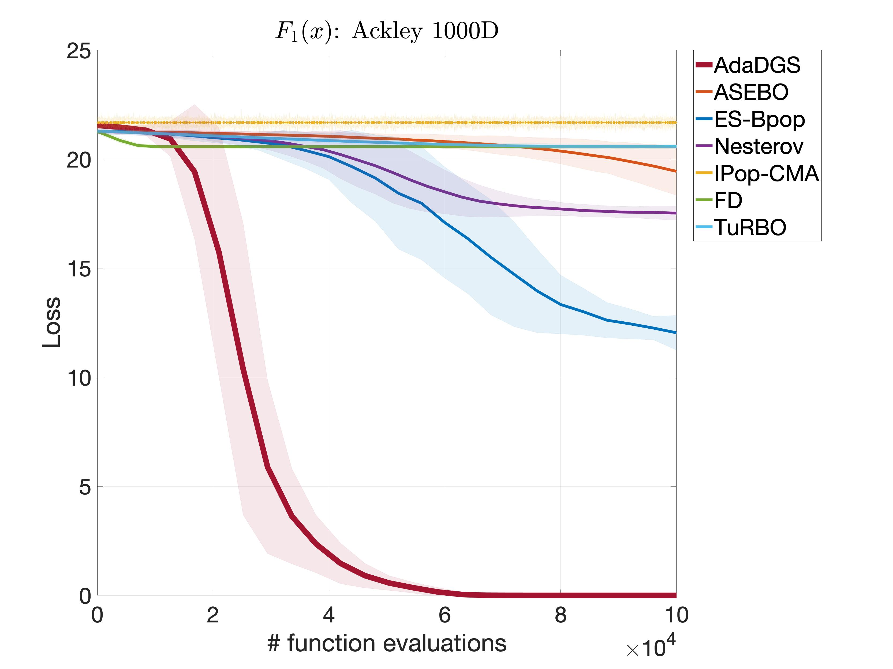

## Ackley function

  

where . The Ackley function represents non-convex landscapes with nearly flat outer region.  The function poses a risk for optimization algorithms, particularly hill-climbing algorithms, to be trapped in one of its many local minima.

- Initial search domain: .
- Global minimum:  &nbsp; at &nbsp; .

 
   &nbsp;&nbsp;&nbsp;&nbsp;&nbsp;
  

