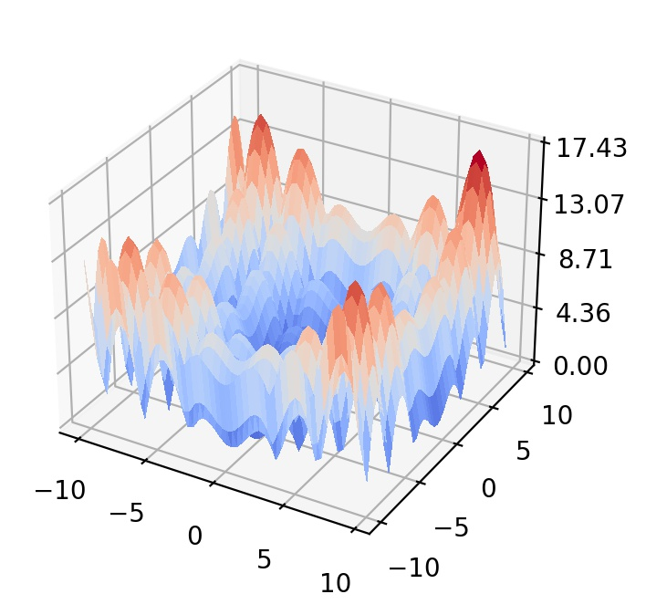
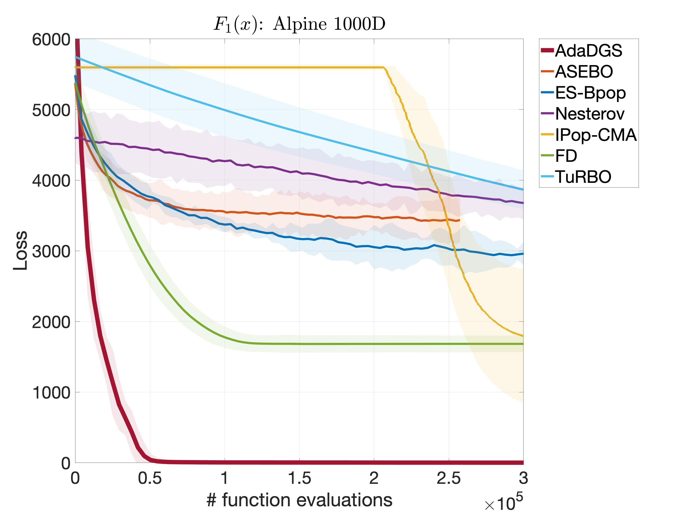

## Alpine function

  

This function represents multimodal landscapes with non-unique global optimum.

- Initial search domain: .
- Global minima:  &nbsp; with &nbsp;  &nbsp; solutions.

 
   &nbsp;&nbsp;&nbsp;&nbsp;&nbsp;
  

