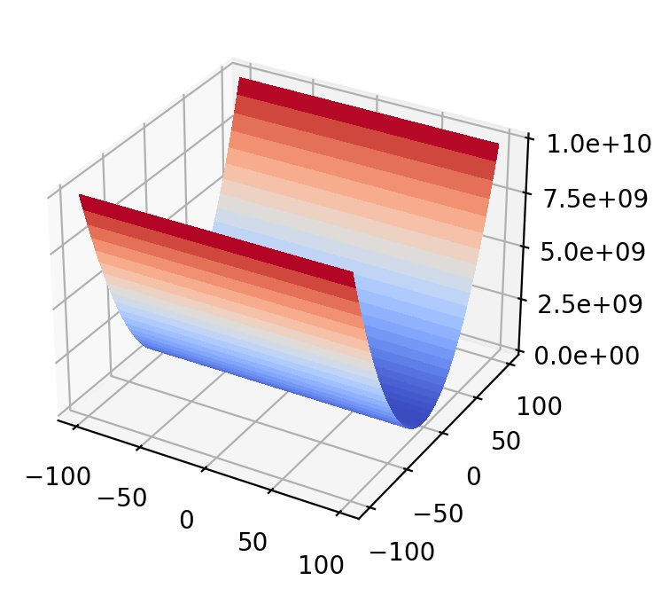

## Bent Cigar function

  

The Bent Cigar function represents convex and anisotropic landscapes. There is a sharp ridge defined along  that must be followed to reach the global minimum, which creates difficulties for optimizations algorithms. 
- Initial search domain: .
- Global minimum:  &nbsp; at .

 
   
  <!  

