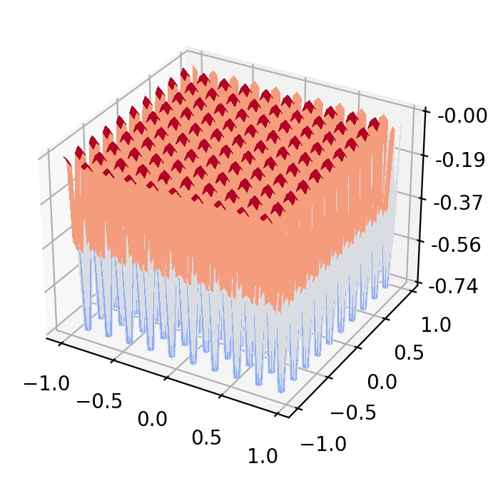

## Deb function

  

The Different Power function represents multimodal, periodic landscapes with non-unique global optimum. All local minima are global minima for this function. 
- Initial search domain: .
- Global minimum:  &nbsp; with multiple solutions.

 
   
  <!  

