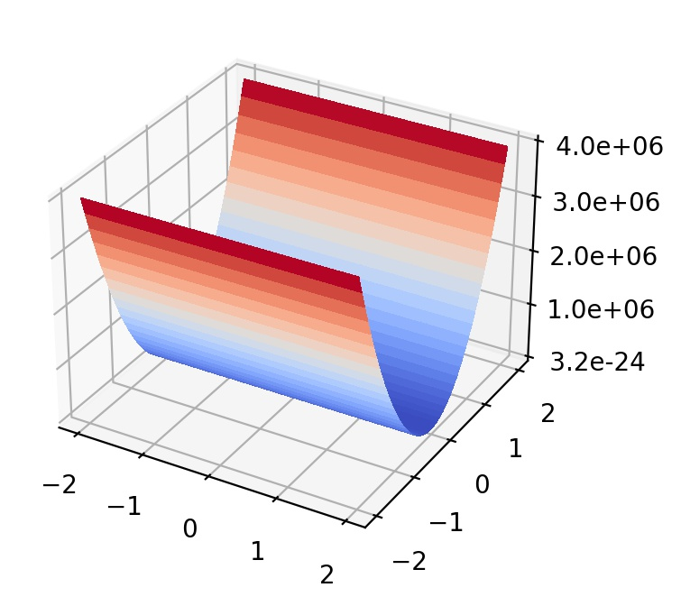
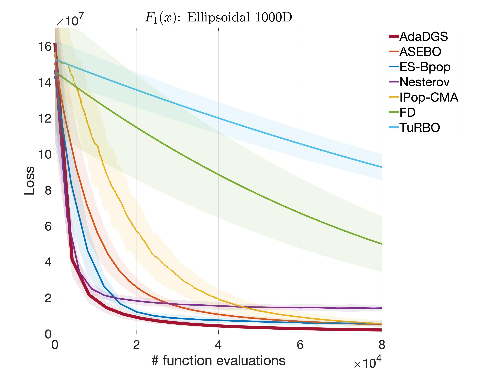

## Ellipsoidal function

  

The Ellipsoidal function represents convex and highly ill-conditioned landscapes. 

- Initial search domain: .
- Global minimum:  &nbsp; at &nbsp; .

 
   &nbsp;&nbsp;&nbsp;&nbsp;&nbsp;
  

