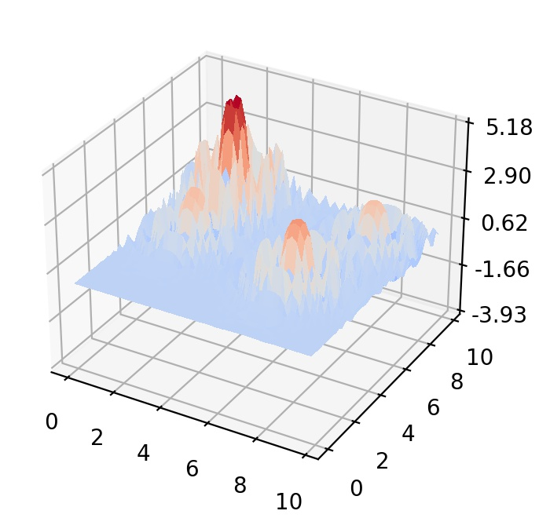

## Langermann function

  

The Langermann function represents multimodal landscapes with unevenly distributed local minima. 
- Initial search domain: .
- Global minimum:  &nbsp; with multiple solutions along the lines .

 
   
  <!  

