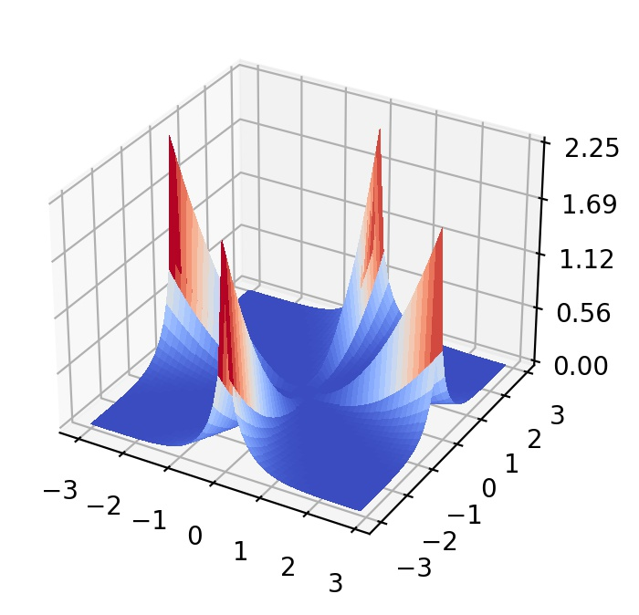

## Mishra 11 function

  

The Mishra function represents multimodal landscapes with infinitely many global optima. 
- Initial search domain: .
- Global minimum:  &nbsp; with multiple solutions along the lines &nbsp; .

 
   
  <!  

