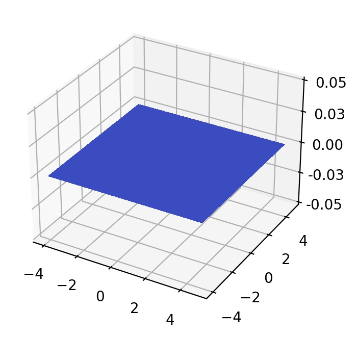

## Powell function

where . The Ackley function represents *non-convex* landscapes with *nearly flat outer region*.  The function poses a risk for optimization algorithms, particularly hill-climbing algorithms, to be trapped in one of its many local minima.

The initial search domain is . The global minimum is .

