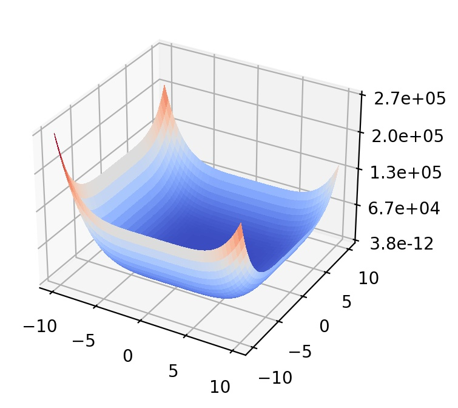

## Quintic function

 . 

The Quintic function represents multimodal landscapes with global structure.

- Initial search domain: .
- Global minimum:  &nbsp; with &nbsp;  &nbsp; being either &nbsp; or .

 
   &nbsp;&nbsp;&nbsp;&nbsp;&nbsp;
  

