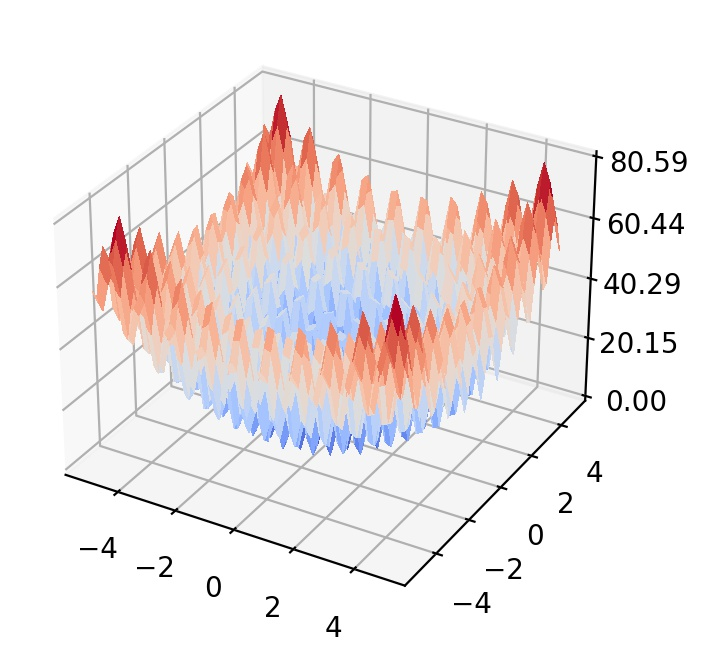

## Rastrigin function

   

The Rastrigin function represents highly multimodal landscapes with global structure.

- Initial search domain: . 
- Global minimum:  &nbsp; at &nbsp; .

 
   &nbsp;&nbsp;&nbsp;&nbsp;&nbsp;
  

