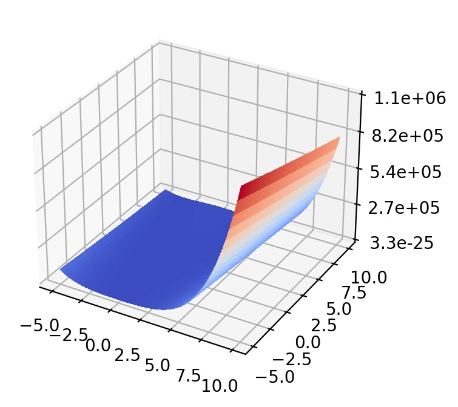
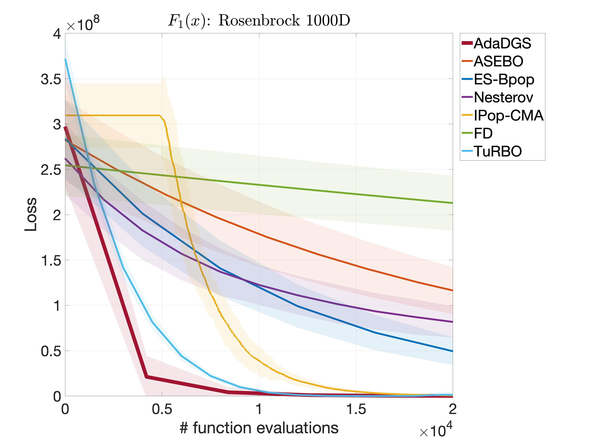

## Rosenbrock function

  

The Rosenbrock function is unimodal, and the global minimum lies in a bending ridge, which needs to be followed to reach solution. The ridge changes its orientation  times. 

- Initial search domain: .
- Global minimum:  &nbsp; at &nbsp; .

 
   &nbsp;&nbsp;&nbsp;&nbsp;&nbsp;
  

