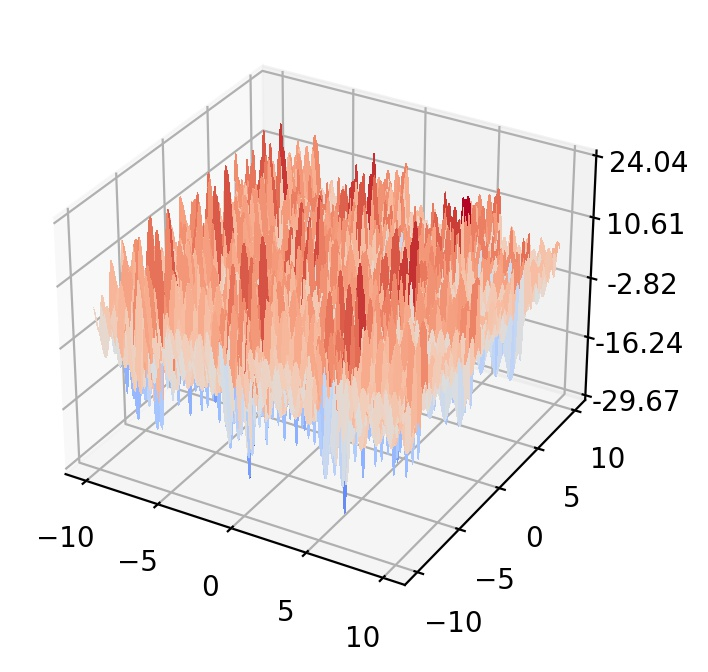

## Shubert function

  

The Shubert function represents multimodal, periodic landscapes with multiple global and local optima. 
- Initial search domain: .
- Global minimum:  &nbsp; with &nbsp;  different solutions.

 
   
  <! />

