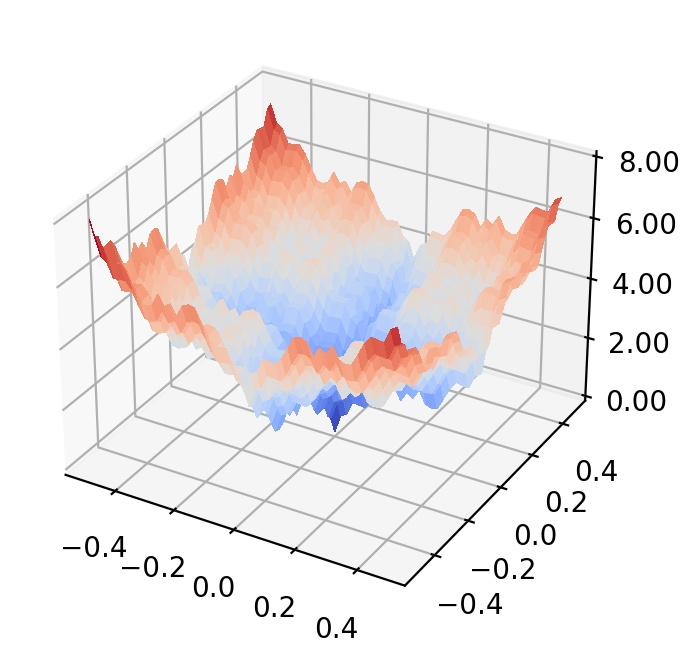

## Weierstrass function

  

where . The Weierstrass function represents highly rugged and repetitive landscapes with non-unique global optimum. 
- Initial search domain: .
- Global minimum:  &nbsp; with multiple solutions.

 
   
  <!  

